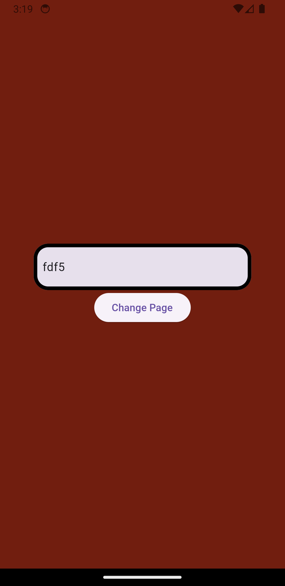
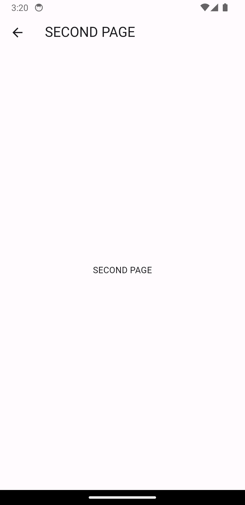

# Change Screen Color
## Getting Started
This project is a created for a study case. When textfield value length equals 4, page color changes with random color.
## Installation

1. Clone the repository:

    `
git clone https://github.com/meliheng/movieapp.git
    `

2. Load the dependencies:

    `
flutter pub get
    `

44. Open an emulator and run the project:
    
    `
    flutter run
    `
## Screeenshots
A few resources to get you started if this is your first Flutter project:

- 

- 
